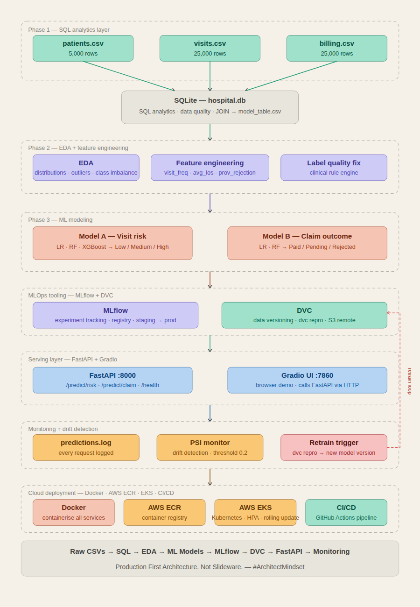
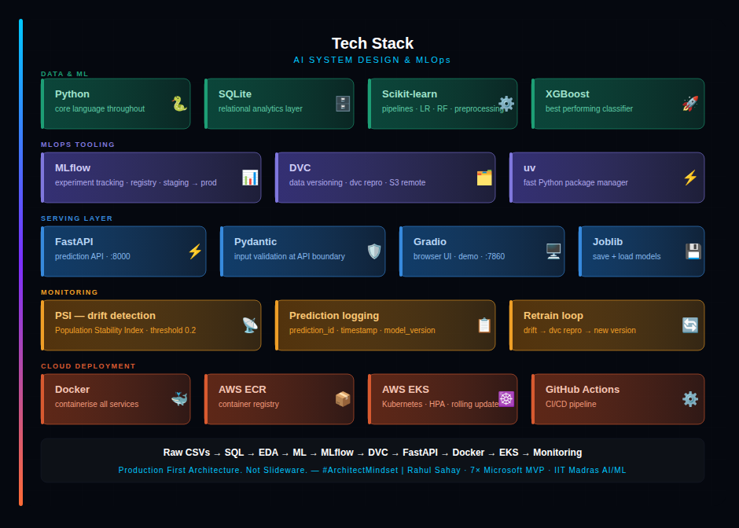

# 🏥 Healthcare AI System

> **Production First Architecture. Not Slideware.** — #ArchitectMindset

An end-to-end enterprise ML system built on real hospital data — from raw CSVs to AWS Kubernetes deployment, with full MLOps tooling, monitoring, and governance.

[](https://www.udemy.com/course/ai-system-design-mlops-from-raw-data-to-aws-kubernetes/?couponCode=2C53F66AED641DA982D2)




---

## ⚙️ Tech Stack



## 🎯 What This System Does

| Model | Input | Prediction | Business Value |
|---|---|---|---|
| **Visit Risk Classifier** | Patient + Visit data | Low / Medium / High risk | Helps hospital ops teams triage and allocate staff proactively |
| **Claim Outcome Predictor** | Billing + Visit data | Paid / Pending / Rejected | Helps finance teams detect rejection-prone claims before submission |

---

## 🏗️ System Architecture

```
Raw Hospital Data
(patients.csv · visits.csv · billing.csv)
        │
        ▼
SQL Analytics Layer
(SQLite · hospital.db)
        │
        ▼
EDA + Feature Engineering
(distributions · outliers · feature creation · label fixes)
        │
        ▼
ML Models
(Model A — Visit Risk · Model B — Claim Outcome)
        │
        ▼
MLOps Layer
├── MLflow (experiment tracking)
├── DVC (data versioning + pipelines)
├── Model Artifacts (joblib files)
├── Feature Schema (single source of truth)
└── Predictions Log (audit trail)
        │
        ▼
Serving Layer
├── FastAPI (prediction APIs)
├── Pydantic (input validation)
├── Gradio UI (demo interface)
└── PSI Monitor (drift detection)
        │
        ▼
Cloud Deployment
├── Docker (containerisation)
├── AWS ECR (image registry)
├── AWS EKS (Kubernetes deployment)
├── GitHub Actions (CI/CD pipeline)
└── Live Endpoint (scalable inference)
        │
        ▼
Retrain Feedback Loop
(drift → DVC repro → new model version)
```

---

## 📁 Project Structure

```
Healthcare/
├── data/                    # Raw CSV data (source layer)
│
├── db/                      # SQLite DB (analytics layer)
│   └── hospital.db
│
├── notebooks/               # Phase-wise EDA + modeling
│
├── src/                     # Training pipeline (core ML logic)
│   ├── training_pipeline.py
│   ├── feature_engineering.py
│   └── model_training/
│
├── api/                     # FastAPI serving layer
│   ├── main.py
│   ├── routers/             # /predict endpoints
│   ├── schemas/             # Pydantic validation
│   └── services/            # Model loading (joblib)
│
├── ui/                      # Gradio UI (browser demo)
│   └── gradio_app.py
│
├── monitoring/              # Drift detection + logging
│   ├── psi_monitor.py
│   └── logger.py
│
├── models/                  # Final production models
│   ├── risk_model.joblib
│   ├── claim_model.joblib
│
├── outputs/                 # Generated datasets
│   ├── model_table.csv
│   └── feature_schema.json
│
├── mlruns/                  # MLflow experiment tracking
├── mlartifacts/             # MLflow artifacts
├── mlflow.db                # MLflow backend DB
│
├── logs/                    # Prediction logs (audit trail)
│   └── predictions.log
│
├── dvc-storage/             # DVC remote storage (local/S3)
├── dvc.yaml                 # DVC pipeline definition
├── dvc.lock
│
├── report/                  # Governance docs
│   ├── model_card.md
│   └── monitoring_strategy.md
│
├── tests/                   # Unit + API tests
│
├── Dockerfile               # FastAPI container
├── docker-compose.yml       # Local multi-service setup
│
├── .github/workflows/       # CI/CD pipelines
│   └── ci_cd.yml
│
├── requirements.txt
└── README.md
```

---

## 🗄️ Dataset Overview

### patients.csv — 5,000 rows

| Column | Type | Description |
|---|---|---|
| patient_id | int | Primary key |
| age | int | Patient age (1–90) |
| gender | str | M / F |
| city | str | Hyderabad, Pune, Chennai, Bangalore, Mumbai, Delhi |
| insurance_provider | str | SecureLife, HealthPlus, CareOne, MediCareX |
| chronic_flag | int | 1 = has chronic condition, 0 = none |
| registration_date | date | First registration at hospital |

### visits.csv — 25,000 rows

| Column | Type | Description |
|---|---|---|
| visit_id | int | Primary key |
| patient_id | int | Foreign key → patients |
| visit_date | date | Date of visit |
| department | str | Cardiology, Orthopedics, ICU, General, ER, Neurology |
| visit_type | str | ER, OPD, ICU |
| length_of_stay_hours | float | Duration of admission |
| **risk_score** | str | **Target A** — Low / Medium / High |
| doctor_id | int | Attending doctor (100–200) |

### billing.csv — 25,000 rows

| Column | Type | Description |
|---|---|---|
| bill_id | int | Primary key |
| visit_id | int | Foreign key → visits |
| billed_amount | float | Amount charged by hospital |
| approved_amount | float | Amount approved by insurer (nullable) |
| **claim_status** | str | **Target B** — Paid / Pending / Rejected |
| payment_days | float | Days to payment (nullable) |
| billing_date | date | Date bill was raised |

---

## 🚀 Quick Start

### Prerequisites
- Python 3.10+
- [uv](https://astral.sh/uv) — fast Python package manager

### Setup

```bash
# 1. Clone the repo
git clone <your-repo-url>
cd Healthcare

# 2. Create virtual environment
uv venv

# 3. Activate (Windows Git Bash)
source .venv/Scripts/activate

# 4. Activate (Mac / Linux)
source .venv/bin/activate

# 5. Install all dependencies
uv pip install -r requirements.txt

# 6. Launch notebooks
jupyter notebook
```

### Run Phase by Phase

```bash
# Phase 1 — SQL Analytics
jupyter notebook notebooks/Phase1_SQL.ipynb

# Phase 2 — EDA
jupyter notebook notebooks/Phase2_EDA.ipynb

# Phase 3 — ML Modeling
jupyter notebook notebooks/Phase3_Modeling.ipynb

# Phase 4 — Evaluation
jupyter notebook notebooks/Phase4_Mlflow.ipynb
```
### Run the ML Flow
```bash
mlflow ui
```

### Production Setup ML FLoW
```bash
mlflow server --backend-store-uri sqlite:///mlflow.db --default-artifact-root ./mlruns --host 127.0.0.1 --port 5000
```
### Run the Pipeline
```bash
python -m src.training_pipeline --model risk
python -m src.training_pipeline --model claim
```

### DVC Pipeline
For running the DVC Pipeline, MLflow server in another terminal should be running.
- Creating Risk Pipeline
```bash
dvc stage add -n train_risk -d src -d outputs/model_table.csv -o models/risk_model_complete_pipeline.joblib -o outputs/feature_schema.json python -m src.training_pipeline --model risk
```
- Creating Claim Pipeline
```bash
uv run dvc stage add -n train_claim -d src -d outputs/model_table.csv -d outputs/feature_schema.json -o models/claim_model_complete_pipeline.joblib python -m src.training_pipeline --model claim
```

### Run the API

```bash
uvicorn api.main:app --reload
```

### Run the Gradio UI

```bash
python ui/gradio_app.py
```

API docs available at: `http://localhost:8000/docs`

---

## 📊 Model Performance

| Model | Algorithm | Test Accuracy | Weighted F1 |
|---|---|---|---|
| Visit Risk | Logistic Regression (baseline) | ~91% | 0.90 |
| Visit Risk | Random Forest | ~95% | 94 |
| Visit Risk | **XGBoost (final)** | **~95%** | **0.94** |
| Claim Outcome | Logistic Regression (baseline) | ~47% | 0.43 |
| Claim Outcome | **Random Forest (final)** | **~55%** | **0.51** |

> ⚠️ **Note:** This project intentionally demonstrates two data scenarios — random synthetic labels (Phase 3A) and clinically-derived labels (Phase 3B). The above numbers reflect Phase 3B (good data). This is a core teaching point of the course. On the same line, claim data needs to be fixed.

---

## 🔍 Key Teaching Points

- **Label quality over model tuning** — same pipeline, 45% → 95% accuracy by fixing the data, not the model
- **Time-based train/test split** — leakage-safe evaluation for temporal data
- **Class imbalance handling** — class_weight, balanced_subsample, SMOTE
- **Bias-variance tradeoff** — live demo of RF overfitting (97% train vs 43% test) and fix
- **Fairness analysis** — model performance broken down by gender, city, insurance provider
- **Production API design** — prediction logging, input validation, model versioning
- **Drift detection** — PSI-based early warning for model degradation

Assignment:- Fix Claim Data labels and then train the model.
---

## 🏛️ Governance

- **Model Card** — `report/model_card.md`
- **Monitoring Strategy** — `report/monitoring_strategy.md`
- **Retraining Plan** — PSI threshold 0.2 triggers retraining pipeline

---

## Enroll here
[](https://www.udemy.com/course/ai-system-design-mlops-from-raw-data-to-aws-kubernetes/?couponCode=2C53F66AED641DA982D2)

## 👨‍💻 Author

**Rahul Sahay**
Principal Architect · Datamatics
7× Microsoft MVP · IIT Madras AI/ML
Udemy Instructor · 47K+ Students

[](https://linkedin.com/in/rahulsahay19)
[](https://www.udemy.com/user/rahulsahay-2)

🔗 Full course & architecture guide:
https://rahulsahay.com

> *Production First Architecture. Not Slideware.* — **#ArchitectMindset**

---

## 📄 License

This project is for educational purposes as part of the Udemy course
**"AI System Design & MLOps: From Raw Data to AWS Kubernetes"**